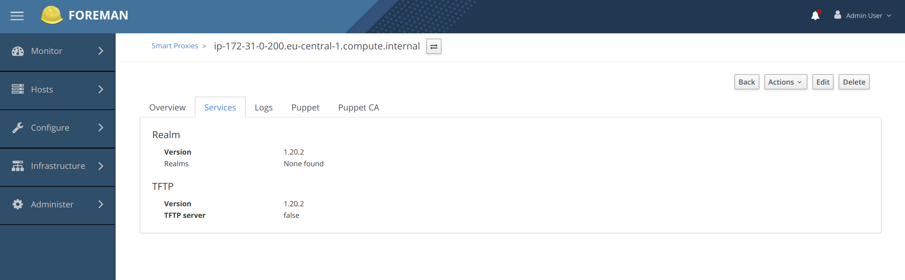

## Step 1. Install dependencies
The plugin depends on a rubygem called radcli which uses C libraries.

```bash
sudo yum install -y gcc ruby-devel krb5-devel openldap-devel
gem install radcli
```

## Step 2. Installing the plugin
Add the following to the file /usr/share/foreman-proxy/bundler.d/Gemfile.local.rb
```
gem 'smart_proxy_realm_ad_plugin'
```
This should make it possible for the smart-proxy to be able to load the plugin.

## Step 3. Activating the plugin
Create the following file /etc/foreman-proxy/settings.d/realm.yml with the below contents:

```
---
# Can be true, false, or http/https to enable just one of the protocols
:enabled: true

# Available providers:
#   realm_ad
#   realm_freeipa
:use_provider: realm_ad
```
## Step 4. Restart smart-proxy

Restart smart-proxy using 
```
systemctl restart smart-proxy
```

## Step 5. Verify that the plugin has been loaded

Look in the /var/log/foreman-proxy/proxy.log log to see if the plugin was loaded
successfully. If it was loaded correctly it will look like this:

```
2019-04-11T20:26:41  [D] Providers ['realm_ad'] are going to be configured for 'realm'
...
2019-04-11T20:26:41  [D] 'realm_ad' settings: 'domain_controller': dc.example.com, 'keytab_path': /etc/foreman-proxy/realm_ad.keytab, 'principal': realm-proxy@EXAMPLE.COM, 'realm': EXAMPLE.COM, 'use_provider': realm_ad
```

If it fails to load the following will be logged
```
2019-04-11T09:37:51  [E] Disabling all modules in the group ['realm']: following providers are not available ['realm_ad']
```


# realmad-notes

This document is my notes on how to set up foreman, katello with Active Directory and the
smart_proxy_realm_ad_plugin .

# Provision servers

* Provision a Centos 7 x86 instance on AWS with a fixed Elastic IP Address
* Provision a Windows Server 2019 server. Configure as a Domain Controller DC01.

# Login
```
ssh -i "~/.ssh/ansible.pem" centos@xxxx.compute.amazonaws.com
```

```bash
[centos@ip-172-31-0-200 ~]$ cat /etc/centos-release
CentOS Linux release 7.6.1810 (Core) 
[centos@ip-172-31-0-200 ~]$ 
```

# Disable SELinux
Set SELINUX=permissive in /etc/sysconfig/config, then reboot, with sudo reboot.

# Update the system
```bash
sudo yum -y update
```

# Install Foreman 1.20

```bash
sudo yum -y update
```

## Enable Puppet repo
```bash
sudo yum -y install https://yum.puppetlabs.com/puppet5/puppet5-release-el-7.noarch.rpm
```

## Enable the EPEL and the Foreman Repos
```bash
sudo yum -y install http://dl.fedoraproject.org/pub/epel/epel-release-latest-7.noarch.rpm
sudo yum -y install https://yum.theforeman.org/releases/1.20/el7/x86_64/foreman-release.rpm
```

## Check whats installed
```bash
# rpm -q --all --last 
foreman-installer-1.20.2-1.el7.noarch         tor 11 apr 2019 08:43:53
puppet-agent-5.5.12-1.el7.x86_64              tor 11 apr 2019 08:43:51
rubygem-powerbar-2.0.1-1.el7.noarch           tor 11 apr 2019 08:43:29
rubygem-multi_json-1.12.2-3.el7.noarch        tor 11 apr 2019 08:43:29
rubygem-logging-2.2.2-3.el7.noarch            tor 11 apr 2019 08:43:29
rubygem-little-plugger-1.1.3-23.el7.noarch    tor 11 apr 2019 08:43:29
rubygem-kafo_wizards-0.0.1-2.el7.noarch       tor 11 apr 2019 08:43:29
rubygem-kafo_parsers-0.1.6-1.el7.noarch       tor 11 apr 2019 08:43:29
rubygem-kafo-2.1.0-1.el7.noarch               tor 11 apr 2019 08:43:29
rubygem-hashie-3.6.0-1.el7.noarch             tor 11 apr 2019 08:43:29
rubygem-clamp-1.1.2-4.el7.noarch              tor 11 apr 2019 08:43:29
rubygem-ansi-1.4.3-2.el7.noarch               tor 11 apr 2019 08:43:29
foreman-selinux-1.20.2-1.el7.noarch           tor 11 apr 2019 08:43:29
ruby-libs-2.0.0.648-34.el7_6.x86_64           tor 11 apr 2019 08:43:28
ruby-irb-2.0.0.648-34.el7_6.noarch            tor 11 apr 2019 08:43:28
rubygems-2.0.14.1-34.el7_6.noarch             tor 11 apr 2019 08:43:28
rubygem-rdoc-4.0.0-34.el7_6.noarch            tor 11 apr 2019 08:43:28
rubygem-psych-2.0.0-34.el7_6.x86_64           tor 11 apr 2019 08:43:28
rubygem-json-1.7.7-34.el7_6.x86_64            tor 11 apr 2019 08:43:28
rubygem-io-console-0.4.2-34.el7_6.x86_64      tor 11 apr 2019 08:43:28
rubygem-highline-1.7.8-4.el7.noarch           tor 11 apr 2019 08:43:28
rubygem-bigdecimal-1.2.0-34.el7_6.x86_64      tor 11 apr 2019 08:43:28
ruby-2.0.0.648-34.el7_6.x86_64                tor 11 apr 2019 08:43:28
gpg-pubkey-ef8d349f-57b6233e                  tor 11 apr 2019 08:43:25
gpg-pubkey-565ea533-5bc49db5                  tor 11 apr 2019 08:43:25
gpg-pubkey-352c64e5-52ae6884                  tor 11 apr 2019 08:43:25
foreman-release-1.20.2-1.el7.noarch           tor 11 apr 2019 08:41:18
epel-release-7-11.noarch                      tor 11 apr 2019 08:41:12
puppet5-release-5.0.0-4.el7.noarch            tor 11 apr 2019 08:40:19
kernel-3.10.0-957.10.1.el7.x86_64             tor 11 apr 2019 08:39:12

...
```

## Download the installer
```bash
sudo yum -y install foreman-installer
```

## Run the installer
```bash
sudo foreman-installer
```

## The installation result
```bash
[centos@ip-172-31-0-200 ~]$ sudo foreman-installer

Installing             Package[foreman-postgresql]                        [0%]
Installing             Package[foreman-cli]                               [28%]
Installing             Exec[foreman-rake-apipie:cache:index]              [85%]

Installing             Done                                               [100%]
  Success!
  * Foreman is running at https://ip-172-31-0-200.eu-central-1.compute.internal
      Initial credentials are admin / yzZhFrgEnAQCiPTv
  * Foreman Proxy is running at https://ip-172-31-0-200.eu-central-1.compute.internal:8443
  * Puppetmaster is running at port 8140
  The full log is at /var/log/foreman-installer/foreman.log
```

## The WebUI proxy settings 


## The installer will install foreman-proxy 

```bash
[centos@ip-172-31-0-200 ~]$ sudo systemctl status foreman-proxy
● foreman-proxy.service - Foreman Proxy
   Loaded: loaded (/usr/lib/systemd/system/foreman-proxy.service; enabled; vendor preset: disabled)
   Active: active (running) since tor 2019-04-11 08:52:22 UTC; 4min 47s ago
 Main PID: 17172 (ruby)
   CGroup: /system.slice/foreman-proxy.service
           └─17172 ruby /usr/share/foreman-proxy/bin/smart-proxy --no-daemonize

apr 11 08:52:22 ip-172-31-0-200.eu-central-1.compute.internal systemd[1]: Starting Foreman Proxy...
apr 11 08:52:22 ip-172-31-0-200.eu-central-1.compute.internal systemd[1]: Started Foreman Proxy.
apr 11 08:52:24 ip-172-31-0-200.eu-central-1.compute.internal smart-proxy[17172]: ip-172-31-0-200.eu-central-1.compute.internal... 35
apr 11 08:52:24 ip-172-31-0-200.eu-central-1.compute.internal smart-proxy[17172]: - -> /features
apr 11 08:52:24 ip-172-31-0-200.eu-central-1.compute.internal smart-proxy[17172]: ip-172-31-0-200.eu-central-1.compute.internal... 35
apr 11 08:52:24 ip-172-31-0-200.eu-central-1.compute.internal smart-proxy[17172]: - -> /features
apr 11 08:52:24 ip-172-31-0-200.eu-central-1.compute.internal smart-proxy[17172]: ip-172-31-0-200.eu-central-1.compute.internal... 35
apr 11 08:52:24 ip-172-31-0-200.eu-central-1.compute.internal smart-proxy[17172]: - -> /features
Hint: Some lines were ellipsized, use -l to show in full.
[centos@ip-172-31-0-200 ~]$ 
```

## Here are the settings files for foreman
```bash
[centos@ip-172-31-0-200 ~]$ sudo ls -R /etc/foreman/
/etc/foreman/:
database.yml  encryption_key.rb  foreman-debug.conf  plugins  settings.yaml

/etc/foreman/plugins:
[centos@ip-172-31-0-200 ~]$ 

The plugins directory is empty.
```

## Logs for foreman-proxy
The foreman-proxy is a webserver that write its logs to /var/log/foreman-proxy/proxy.log
```
[centos@ip-172-31-0-200 ~]$ sudo less /var/log/foreman-proxy/proxy.log
2019-04-11T08:52:22  [I] Successfully initialized 'foreman_proxy'
2019-04-11T08:52:22  [I] Successfully initialized 'tftp'
2019-04-11T08:52:22  [I] Successfully initialized 'puppetca_hostname_whitelisting'
2019-04-11T08:52:22  [I] Successfully initialized 'puppetca'
2019-04-11T08:52:22  [I] Started puppet class cache initialization
2019-04-11T08:52:22  [I] Successfully initialized 'puppet_proxy_puppet_api'
2019-04-11T08:52:22  [I] Successfully initialized 'puppet'
2019-04-11T08:52:22  [I] Successfully initialized 'logs'
2019-04-11T08:52:22  [I] WEBrick 1.3.1
2019-04-11T08:52:22  [I] ruby 2.0.0 (2015-12-16) [x86_64-linux]
...
```

## Install smart_proxy_realm_ad_plugin 0.1 from rubygems.org

The rubygem is a native extension, is a ruby library that uses a C library to talk to active directory.

```bash
[centos@ip-172-31-0-200 ~]$ gem install smart_proxy_realm_ad_plugin
Fetching: rake-compiler-1.0.7.gem (100%)
Successfully installed rake-compiler-1.0.7
Fetching: radcli-1.0.0.gem (100%)
Building native extensions.  This could take a while...
ERROR:  Error installing smart_proxy_realm_ad_plugin:
	ERROR: Failed to build gem native extension.

    /usr/bin/ruby extconf.rb
mkmf.rb can't find header files for ruby at /usr/share/include/ruby.h


Gem files will remain installed in /home/centos/.gem/ruby/gems/radcli-1.0.0 for inspection.
Results logged to /home/centos/.gem/ruby/gems/radcli-1.0.0/ext/radcli/gem_make.out
[centos@ip-172-31-0-200 ~]$ 
```

## Ruby Developer Tools to use the C extension
The rubygem seems to be an C extension, we need GCC and ruby-devel package.
Lets see what happens.

```
sudo yum install -y gcc ruby-devel 
zlib-devel
```
Lets see what happens now:

```bash
[centos@ip-172-31-0-200 ~]$ gem install smart_proxy_realm_ad_plugin
Building native extensions.  This could take a while...
ERROR:  Error installing smart_proxy_realm_ad_plugin:
	ERROR: Failed to build gem native extension.

    /usr/bin/ruby extconf.rb
creating Makefile

make "DESTDIR="
gcc -I. -I/usr/include -I/usr/include/ruby/backward -I/usr/include -I. -I/usr/include -I/home/centos/.gem/ruby/gems/radcli-1.0.0/ext/radcli/ext/radcli    -fPIC -O2 -g -pipe -Wall -Wp,-D_FORTIFY_SOURCE=2 -fexceptions -fstack-protector-strong --param=ssp-buffer-size=4 -grecord-gcc-switches -mtune=generic -fPIC -m64 -o radcli.o -c radcli.c
In file included from ./radcli.h:5:0,
                 from radcli.c:2:
./adconn.h:29:23: fatal error: krb5/krb5.h: No such file or directory
 #include <krb5/krb5.h>
                       ^
compilation terminated.
make: *** [radcli.o] Error 1


Gem files will remain installed in /home/centos/.gem/ruby/gems/radcli-1.0.0 for inspection.
Results logged to /home/centos/.gem/ruby/gems/radcli-1.0.0/ext/radcli/gem_make.out
[centos@ip-172-31-0-200 ~]$ 
```

The gem seems to include some header krb5/krb5.h

The smart_proxy_realm_ad_plugin has a dependency on this package "radcli":

https://github.com/theforeman/smart_proxy_realm_ad_plugin/blob/master/lib/smart_proxy_realm_ad/provider.rb#L2

It also published here: https://rubygems.org/gems/radcli

We run the gem install we get below:

```bash
> gem install radcli
[centos@ip-172-31-0-200 ~]$ gem install radcli
Building native extensions.  This could take a while...
ERROR:  Error installing radcli:
	ERROR: Failed to build gem native extension.

    /usr/bin/ruby extconf.rb
creating Makefile

make "DESTDIR="
gcc -I. -I/usr/include -I/usr/include/ruby/backward -I/usr/include -I. -I/usr/include -I/home/centos/.gem/ruby/gems/radcli-1.0.0/ext/radcli/ext/radcli    -fPIC -O2 -g -pipe -Wall -Wp,-D_FORTIFY_SOURCE=2 -fexceptions -fstack-protector-strong --param=ssp-buffer-size=4 -grecord-gcc-switches -mtune=generic -fPIC -m64 -o radcli.o -c radcli.c
In file included from ./radcli.h:5:0,
                 from radcli.c:2:
./adconn.h:29:23: fatal error: krb5/krb5.h: No such file or directory
 #include <krb5/krb5.h>
                       ^
compilation terminated.
make: *** [radcli.o] Error 1


Gem files will remain installed in /home/centos/.gem/ruby/gems/radcli-1.0.0 for inspection.
Results logged to /home/centos/.gem/ruby/gems/radcli-1.0.0/ext/radcli/gem_make.out
[centos@ip-172-31-0-200 ~]$ 
```
This C library need this header file. It should be available among these packages:

```
sudo yum -y install git make gcc automake autoconf krb5-devel openldap-devel cyrus-sasl-devel cyrus-sasl-gssapi
```

We try one at a time:
```
sudo yum -y install krb5-devel
...
[centos@ip-172-31-0-200 ~]$ sudo find / -name krb5.h
/usr/include/krb5/krb5.h
/usr/include/krb5.h
[centos@ip-172-31-0-200 ~]$ 
```

We try again:
```bash
> gem install radcli
```

We get: 
```bash
[centos@ip-172-31-0-200 ~]$ gem install radcli
Building native extensions.  This could take a while...
ERROR:  Error installing radcli:
	ERROR: Failed to build gem native extension.

    /usr/bin/ruby extconf.rb
creating Makefile

make "DESTDIR="
gcc -I. -I/usr/include -I/usr/include/ruby/backward -I/usr/include -I. -I/usr/include -I/home/centos/.gem/ruby/gems/radcli-1.0.0/ext/radcli/ext/radcli    -fPIC -O2 -g -pipe -Wall -Wp,-D_FORTIFY_SOURCE=2 -fexceptions -fstack-protector-strong --param=ssp-buffer-size=4 -grecord-gcc-switches -mtune=generic -fPIC -m64 -o radcli.o -c radcli.c
In file included from ./radcli.h:5:0,
                 from radcli.c:2:
./adconn.h:30:18: fatal error: ldap.h: No such file or directory
 #include <ldap.h>
                  ^
compilation terminated.
make: *** [radcli.o] Error 1


Gem files will remain installed in /home/centos/.gem/ruby/gems/radcli-1.0.0 for inspection.
Results logged to /home/centos/.gem/ruby/gems/radcli-1.0.0/ext/radcli/gem_make.out
[centos@ip-172-31-0-200 ~]$ u
```

We install
```bash
sudo yum -y install openldap-devel
```

Then it works:
```bash

Installed:
  openldap-devel.x86_64 0:2.4.44-21.el7_6                                                                                            

Dependency Installed:
  cyrus-sasl.x86_64 0:2.1.26-23.el7                              cyrus-sasl-devel.x86_64 0:2.1.26-23.el7                             

Complete!
[centos@ip-172-31-0-200 ~]$ gem install radcli
Building native extensions.  This could take a while...
Successfully installed radcli-1.0.0
Parsing documentation for radcli-1.0.0
unable to convert "\x81" from ASCII-8BIT to UTF-8 for lib/radcli.so, skipping
Installing ri documentation for radcli-1.0.0
1 gem installed
```

This is our installed RPM history:
```bash
openldap-devel-2.4.44-21.el7_6.x86_64         tor 11 apr 2019 09:16:59
cyrus-sasl-devel-2.1.26-23.el7.x86_64         tor 11 apr 2019 09:16:59
cyrus-sasl-2.1.26-23.el7.x86_64               tor 11 apr 2019 09:16:58
pcre-devel-8.32-17.el7.x86_64                 tor 11 apr 2019 09:15:29
libverto-devel-0.2.5-4.el7.x86_64             tor 11 apr 2019 09:15:29
libsepol-devel-2.5-10.el7.x86_64              tor 11 apr 2019 09:15:29
libselinux-devel-2.5-14.1.el7.x86_64          tor 11 apr 2019 09:15:29
libcom_err-devel-1.42.9-13.el7.x86_64         tor 11 apr 2019 09:15:29
krb5-devel-1.15.1-37.el7_6.x86_64             tor 11 apr 2019 09:15:29
keyutils-libs-devel-1.5.8-3.el7.x86_64        tor 11 apr 2019 09:15:29
ruby-devel-2.0.0.648-34.el7_6.x86_64          tor 11 apr 2019 09:08:27
gcc-4.8.5-36.el7_6.1.x86_64                   tor 11 apr 2019 09:08:27
```

## Foreman setup

The initial smart-proxy is not a realm proxy. It doesnt support this feature. We have
to enable it. If its enabled we should be able to add the realm and choose the proxy from the dropdown above.

## Editing the proxy settings

```bash
[centos@ip-172-31-0-200 settings.d]$ cd /etc/foreman-proxy/settings.d/
[centos@ip-172-31-0-200 settings.d]$ ls -l 
total 112
-rw-r-----. 1 root foreman-proxy  317 11 apr 08.52 bmc.yml
-rw-r-----. 1 root foreman-proxy  459 11 apr 08.52 dhcp_isc.yml
-rw-r-----. 1 root foreman-proxy  214 11 apr 08.52 dhcp_libvirt.yml
-rw-r--r--. 1 root root           596 12 feb 13.48 dhcp_native_ms.yml
-rw-r-----. 1 root foreman-proxy  471 11 apr 08.52 dhcp.yml
-rw-r--r--. 1 root root           195 12 feb 13.48 dns_dnscmd.yml
-rw-r-----. 1 root foreman-proxy  213 11 apr 08.52 dns_libvirt.yml
-rw-r-----. 1 root foreman-proxy  535 11 apr 08.52 dns_nsupdate_gss.yml
-rw-r-----. 1 root foreman-proxy  198 11 apr 08.52 dns_nsupdate.yml
-rw-r-----. 1 root foreman-proxy  327 11 apr 08.52 dns.yml
-rw-r--r--. 1 root root            92 12 feb 13.48 facts.yml
-rw-r--r--. 1 root root           353 12 feb 13.48 httpboot.yml
-rw-r-----. 1 root foreman-proxy   76 11 apr 08.52 logs.yml
-rw-r-----. 1 root foreman-proxy  124 11 apr 08.52 puppetca_hostname_whitelisting.yml
-rw-r-----. 1 root foreman-proxy  150 11 apr 08.52 puppetca_token_whitelisting.yml
-rw-r-----. 1 root foreman-proxy  124 11 apr 08.52 puppetca.yml
-rw-r-----. 1 root foreman-proxy  307 11 apr 08.52 puppet_proxy_customrun.yml
-rw-r-----. 1 root foreman-proxy 1135 11 apr 08.52 puppet_proxy_legacy.yml
-rw-r-----. 1 root foreman-proxy  284 11 apr 08.52 puppet_proxy_mcollective.yml
-rw-r-----. 1 root foreman-proxy  785 11 apr 08.52 puppet_proxy_puppet_api.yml
-rw-r-----. 1 root foreman-proxy  325 11 apr 08.52 puppet_proxy_puppetrun.yml
-rw-r-----. 1 root foreman-proxy  125 11 apr 08.52 puppet_proxy_salt.yml
-rw-r-----. 1 root foreman-proxy  560 11 apr 08.52 puppet_proxy_ssh.yml
-rw-r-----. 1 root foreman-proxy  411 11 apr 08.52 puppet.yml
-rw-r-----. 1 root foreman-proxy  235 12 feb 13.48 realm_freeipa.yml
-rw-r-----. 1 root foreman-proxy  176 11 apr 08.52 realm.yml
-rw-r-----. 1 root foreman-proxy 1109 11 apr 08.52 templates.yml
-rw-r-----. 1 root foreman-proxy  170 11 apr 08.52 tftp.yml
[centos@ip-172-31-0-200 settings.d]$ 
```

```bash
[centos@ip-172-31-0-200 settings.d]$ sudo cat realm.yml 
---
# Can be true, false, or http/https to enable just one of the protocols
:enabled: false

# Available providers:
#   realm_ad
#   realm_freeipa
:use_provider: realm_freeipa
[centos@ip-172-31-0-200 settings.d]$ 
```

We modify this file as below:
```bash
[centos@ip-172-31-0-200 settings.d]$ sudo cat realm.yml 
---
# Can be true, false, or http/https to enable just one of the protocols
:enabled: true

# Available providers:
#   realm_ad
#   realm_freeipa
:use_provider: realm_ad
[centos@ip-172-31-0-200 settings.d]$ 
```

We restart foreman-proxy:
```bash
sudo systemctl restart foreman-proxy
```

The foreman-proxy server will display this in its logs file:
```bash
[centos@ip-172-31-0-200 settings.d]$ sudo cat /var/log/foreman-proxy/proxy.log|grep "Disabling"
2019-04-11T09:37:51  [E] Disabling all modules in the group ['realm']: following providers are not available ['realm_ad']
[centos@ip-172-31-0-200 settings.d]$ 
```

The following code in foreman-proxy will load the plugin:

https://github.com/theforeman/smart-proxy/blob/ca32f0afbd5e68d1adc8934dc8f7f0f85b8a9256/lib/proxy/plugin_initializer.rb#L52

# Enabling extended debug logs in smart-proxy
Set verbose logging to see how smart-proxy loads the realm plugin

```bash
> cat settings.yml|grep LOG -C 5
# ssl_certificate, ssl_ca_file, and ssl_private_key correspondingly
# default values for https_port is 8443
:https_port: 8443
#:http_port: 8000
# Log configuration
# Uncomment and modify if you want to change the location of the log file or use STDOUT or SYSLOG values
:log_file: /var/log/foreman-proxy/proxy.log
# Uncomment and modify if you want to change the log level
# WARN, DEBUG, ERROR, FATAL, INFO, UNKNOWN
:log_level: INFO
# The maximum size of a log file before it's rolled (in MiB)
```

```bash
[root@ip-172-31-0-200 foreman-proxy]# cat settings.yml|grep log_level
:log_level: DEBUG
[root@ip-172-31-0-200 foreman-proxy]# sudo systemctl restart foreman-proxy
[root@ip-172-31-0-200 foreman-proxy]# 
```

The logs:
```bash
[root@ip-172-31-0-200 foreman-proxy]# tail -f /var/log/foreman-proxy/proxy.log
         9c:9c:d7:17:4d:5e:ec:c6:9b:77:cd:c3:4e:1f:4e:9d:c6:7f:
         54:c6:56:ab:81:3e:95:e2

2019-04-11T10:02:36  [D] Rack::Handler::WEBrick is mounted on /.
2019-04-11T10:02:36  [I] WEBrick::HTTPServer#start: pid=2487 port=8443
2019-04-11T10:02:36  [I] Smart proxy has launched on 1 socket(s), waiting for requests
2019-04-11T10:02:36  [D] Initializing puppet class cache for 'production' environment
2019-04-11T10:02:36  [D] Initializing puppet class cache for 'common' environment
2019-04-11T10:02:36  [D] Initializing puppet class cache for 'development' environment
2019-04-11T10:02:36  [I] Finished puppet class cache initialization
2019-04-11T10:03:10  [I] going to shutdown ...
2019-04-11T10:03:10  [I] WEBrick::HTTPServer#start done.
2019-04-11T10:03:10  [D] 'tftp' settings: 'enabled': https, 'tftp_connect_timeout': 10 (default), 'tftp_dns_timeout': 10 (default), 'tftp_read_timeout': 60 (default), 'tftproot': /var/lib/tftpboot (default)
2019-04-11T10:03:10  [D] 'tftp' ports: 'http': false, 'https': true
2019-04-11T10:03:10  [D] 'puppetca' settings: 'enabled': https, 'ssldir': /etc/puppetlabs/puppet/ssl, 'use_provider': puppetca_hostname_whitelisting (default)
2019-04-11T10:03:10  [D] 'puppetca' ports: 'http': false, 'https': true
2019-04-11T10:03:10  [D] 'puppet' settings: 'enabled': https, 'puppet_version': 5.5.12, 'use_provider': [:puppet_proxy_puppet_api]
2019-04-11T10:03:10  [D] 'puppet' ports: 'http': false, 'https': true
2019-04-11T10:03:10  [D] 'realm' settings: 'enabled': true, 'use_provider': realm_ad
2019-04-11T10:03:10  [D] 'realm' ports: 'http': true, 'https': true
2019-04-11T10:03:10  [D] 'logs' settings: 'enabled': https
2019-04-11T10:03:10  [D] 'logs' ports: 'http': false, 'https': true
2019-04-11T10:03:10  [D] Providers ['puppetca_hostname_whitelisting'] are going to be configured for 'puppetca'
2019-04-11T10:03:10  [D] Providers ['puppet_proxy_puppet_api'] are going to be configured for 'puppet'
2019-04-11T10:03:10  [E] Disabling all modules in the group ['realm']: following providers are not available ['realm_ad']
2019-04-11T10:03:10  [D] 'puppetca_hostname_whitelisting' settings: 'autosignfile': /etc/puppetlabs/puppet/autosign.conf, 'ssldir': /etc/puppetlabs/puppet/ssl, 'use_provider': puppetca_hostname_whitelisting
2019-04-11T10:03:10  [D] 'puppet_proxy_puppet_api' settings: 'api_timeout': 30 (default), 'classes_retriever': apiv3, 'environments_retriever': apiv3, 'puppet_ssl_ca': /etc/puppetlabs/puppet/ssl/certs/ca.pem, 'puppet_ssl_cert': /etc/puppetlabs/puppet/ssl/certs/ip-172-31-0-200.eu-central-1.compute.internal.pem, 'puppet_ssl_key': /etc/puppetlabs/puppet/ssl/private_keys/ip-172-31-0-200.eu-central-1.compute.internal.pem, 'puppet_url': https://ip-172-31-0-200.eu-central-1.compute.internal:8140, 'puppet_version': 5.5.12, 'use_provider': [:puppet_proxy_puppet_api]
2019-04-11T10:03:10  [I] Successfully initialized 'foreman_proxy'
2019-04-11T10:03:10  [I] Successfully initialized 'tftp'
2019-04-11T10:03:10  [I] Successfully initialized 'puppetca_hostname_whitelisting'
2019-04-11T10:03:10  [I] Successfully initialized 'puppetca'
2019-04-11T10:03:10  [I] Started puppet class cache initialization
2019-04-11T10:03:10  [I] Successfully initialized 'puppet_proxy_puppet_api'
2019-04-11T10:03:10  [I] Successfully initialized 'puppet'
2019-04-11T10:03:10  [D] Log buffer API initialized, available capacity: 2000/1000
2019-04-11T10:03:10  [I] Successfully initialized 'logs'
2019-04-11T10:03:11  [I] WEBrick 1.3.1
2019-04-11T10:03:11  [I] ruby 2.0.0 (2015-12-16) [x86_64-linux]
2019-04-11T10:03:11  [D] TCPServer.new(::, 8443)
2019-04-11T10:03:11  [I] 
```

If the smart-proxy cant find the plugin provider, where did it go on the host filesystem ? 
Each plugin has a provider.rb file, so we search for this file on the host:

# Setup the plugin 

The instructions on how to install a plugin are here: https://projects.theforeman.org/projects/foreman/wiki/How_to_Install_a_Smart-Proxy_Plugin
In the case of our plugin, the section "From Source Installation" is what we need.

I think that this  instruction is really hard to understand.
It can also be easy to mix a foreman plugin with a foreman-proxy plugin. 

We need to create a Gemfile.local.rb with the following content:

```
gem 'smart_proxy_realm_ad_plugin'
``

and place it in the following path

/usr/share/foreman-proxy/bundler.d/Gemfile.local.rb

This path is refered to as ~foreman-proxy/bundler.d in the Smart-Proxy plugin guide.

Here is the details

```bash
[root@ip-172-31-0-200 bundler.d]# find / -name bundler.d
/usr/share/foreman/bundler.d
/usr/share/foreman-proxy/bundler.d
/usr/share/foreman-proxy/modules/realm_ad/bundler.d
/usr/local/share/gems/gems/smart_proxy_realm_ad_plugin-0.1/bundler.d
[root@ip-172-31-0-200 bundler.d]# pwd
/usr/share/foreman-proxy/bundler.d
[root@ip-172-31-0-200 bundler.d]# cat 
bmc.rb                          Gemfile.local.rb                libvirt.rb                      puppet.rb
dhcp_isc.rb                     krb5.rb                         puppetca_token_whitelisting.rb  realm_freeipa.rb
[root@ip-172-31-0-200 bundler.d]# cat Gemfile.local.rb 
gem 'smart_proxy_realm_ad_plugin'
[root@ip-172-31-0-200 bundler.d]# cat ^C
[root@ip-172-31-0-200 bundler.d]# service foreman-proxy restart
Redirecting to /bin/systemctl restart foreman-proxy.service
[root@ip-172-31-0-200 bundler.d]# 
```

Looking in the logs we see this:
```
2019-04-11T20:22:29  [D] Providers ['puppetca_hostname_whitelisting'] are going to be configured for 'puppetca'
2019-04-11T20:22:29  [D] Providers ['puppet_proxy_puppet_api'] are going to be configured for 'puppet'
2019-04-11T20:22:29  [D] Providers ['realm_ad'] are going to be configured for 'realm'
2019-04-11T20:22:29  [D] 'puppetca_hostname_whitelisting' settings: 'autosignfile': /etc/puppetlabs/puppet/autosign.conf, 'ssldir': /etc/puppetlabs/puppet/ssl, 'use_provider': puppetca_hostname_whitelisting
2019-04-11T20:22:29  [D] 'puppet_proxy_puppet_api' settings: 'api_timeout': 30 (default), 'classes_retriever': apiv3, 'environments_retriever': apiv3, 'puppet_ssl_ca': /etc/puppetlabs/puppet/ssl/certs/ca.pem, 'puppet_ssl_cert': /etc/puppetlabs/puppet/ssl/certs/ip-172-31-0-200.eu-central-1.compute.internal.pem, 'puppet_ssl_key': /etc/puppetlabs/puppet/ssl/private_keys/ip-172-31-0-200.eu-central-1.compute.internal.pem, 'puppet_url': https://ip-172-31-0-200.eu-central-1.compute.internal:8140, 'puppet_version': 5.5.12, 'use_provider': [:puppet_proxy_puppet_api]
2019-04-11T20:22:29  [W] Couldn't find settings file /etc/foreman-proxy/settings.d/realm_ad.yml. Using default settings.
2019-04-11T20:22:29  [D] 'realm_ad' settings: 'use_provider': realm_ad
2019-04-11T20:22:29  [E] Disabling all modules in the group ['realm_ad', 'realm'] due to a failure in one of them: Parameter 'realm' is expected to have a non-empty value
2019-04-11T20:22:29  [D] <Array> ["/usr/share/foreman-proxy/lib/proxy/plugin_validators.rb:41:in `validate!'", "/usr/share/foreman-proxy/lib/proxy/plugin_validators.rb:21:in `evaluate_predicate_and_validate!'", "/usr/share/foreman-proxy/lib/proxy/plugin_initializer.rb:333:in `block in execute_validators'", "/usr/share/foreman-proxy/lib/proxy/plugin_initializer.rb:330:in `each'", "/usr/share/foreman-proxy/lib/proxy/plugin_initializer.rb:330:in `inject'", "/usr/share/foreman-proxy/lib/proxy/plugin_initializer.rb:330:in `execute_validators'", "/usr/share/foreman-proxy/lib/proxy/plugin_initializer.rb:324:in `validate_settings'", "/usr/share/foreman-proxy/lib/proxy/plugin_initializer.rb:270:in `load_settings'", "/usr/share/foreman-proxy/lib/proxy/plugin_initializer.rb:249:in `load_provider_settings'", "/usr/share/foreman-proxy/lib/proxy/plugin_initializer.rb:84:in `block in load_provider_settings'", "/usr/share/foreman-proxy/lib/proxy/plugin_initializer.rb:83:in `each'", "/usr/share/foreman-proxy/lib/proxy/plugin_initializer.rb:83:in `load_provider_settings'", "/usr/share/foreman-proxy/lib/proxy/plugin_initializer.rb:165:in `block in initialize_plugins'", "/usr/share/foreman-proxy/lib/proxy/plugin_initializer.rb:165:in `each'", "/usr/share/foreman-proxy/lib/proxy/plugin_initializer.rb:165:in `initialize_plugins'", "/usr/share/foreman-proxy/lib/launcher.rb:168:in `launch'", "/usr/share/foreman-proxy/bin/smart-proxy:6:in `<main>'"]
```

We have to create a settings file for the plugin:

```bash
<pre>[root@ip-172-31-0-200 bundler.d]# cat /etc/foreman-proxy/settings.d/realm_ad.yml 
---
# Authentication for Kerberos-based Realms
:realm: EXAMPLE.COM

# Kerberos pricipal used to authenticate against Active Directory
:principal: realm-proxy@EXAMPLE.COM

# Path to the keytab used to authenticate against Active Directory
:keytab_path:  /etc/foreman-proxy/realm_ad.keytab

# FQDN of the Domain Controller
:domain_controller: dc.example.com

# Optional: OU where the machine account shall be placed
#:ou: OU=Linux,OU=Servers,DC=example,DC=com

# Optional: Prefix for the computername
#:computername_prefix: &apos;&apos;

# Optional: Generate the computername by calculating the SHA256 hexdigest of the hostname
#:computername_hash: false

# Optional:  use the fqdn of the host to generate the computername
#:computername_use_fqdn: false
[root@ip-172-31-0-200 bundler.d]# 
```

Then restart the foreman-proxy service.
We then check the log file:

```bash
2019-04-11T20:26:41  [D] 'puppet' ports: 'http': false, 'https': true
2019-04-11T20:26:41  [D] 'realm' settings: 'enabled': true, 'use_provider': realm_ad
2019-04-11T20:26:41  [D] 'realm' ports: 'http': true, 'https': true
2019-04-11T20:26:41  [D] 'logs' settings: 'enabled': https
2019-04-11T20:26:41  [D] 'logs' ports: 'http': false, 'https': true
2019-04-11T20:26:41  [D] Providers ['puppetca_hostname_whitelisting'] are going to be configured for 'puppetca'
2019-04-11T20:26:41  [D] Providers ['puppet_proxy_puppet_api'] are going to be configured for 'puppet'
2019-04-11T20:26:41  [D] Providers ['realm_ad'] are going to be configured for 'realm'
2019-04-11T20:26:41  [D] 'puppetca_hostname_whitelisting' settings: 'autosignfile': /etc/puppetlabs/puppet/autosign.conf, 'ssldir': /etc/puppetlabs/puppet/ssl, 'use_provider': puppetca_hostname_whitelisting
2019-04-11T20:26:41  [D] 'puppet_proxy_puppet_api' settings: 'api_timeout': 30 (default), 'classes_retriever': apiv3, 'environments_retriever': apiv3, 'puppet_ssl_ca': /etc/puppetlabs/puppet/ssl/certs/ca.pem, 'puppet_ssl_cert': /etc/puppetlabs/puppet/ssl/certs/ip-172-31-0-200.eu-central-1.compute.internal.pem, 'puppet_ssl_key': /etc/puppetlabs/puppet/ssl/private_keys/ip-172-31-0-200.eu-central-1.compute.internal.pem, 'puppet_url': https://ip-172-31-0-200.eu-central-1.compute.internal:8140, 'puppet_version': 5.5.12, 'use_provider': [:puppet_proxy_puppet_api]
2019-04-11T20:26:41  [D] 'realm_ad' settings: 'domain_controller': dc.example.com, 'keytab_path': /etc/foreman-proxy/realm_ad.keytab, 'principal': realm-proxy@EXAMPLE.COM, 'realm': EXAMPLE.COM, 'use_provider': realm_ad
```
# Configure foremam-proxy in the WebGUI

After the smart-proxy server have managed to load our plugin, we can activate it through
the foreman web-ui here, we click on the refresh feature button and the below view will be shown.





# Creating the Realm

The creat realm dialog will now give us a realm proxy dropdown option.


We can see the created realm:


# Host Create
If we create a host associated with the realm EXAMPLE.COM the foreman server will 
send a request to the smart-proxy realm ad plugin to add this host to the realm.

# Host Reinstall
If we reinstall a host, likewise the foreman server will send q request to the plugin,
and request a reset of the host servers credential (computer account) in the domain.

# Host Delete
If we delete a host, likewise the foreman server will send request to the plugin,
and request a deletion of the host server computer account in the domain.

# Installing the plugin

After resolving the depenceies with realm the below will work.

```bash
[centos@ip-172-31-0-200 settings.d]$ sudo gem install smart_proxy_realm_ad_plugin
Fetching: rake-compiler-1.0.7.gem (100%)
Successfully installed rake-compiler-1.0.7
Fetching: radcli-1.0.0.gem (100%)
Building native extensions.  This could take a while...
Successfully installed radcli-1.0.0
Fetching: smart_proxy_realm_ad_plugin-0.1.gem (100%)
Successfully installed smart_proxy_realm_ad_plugin-0.1
Parsing documentation for rake-compiler-1.0.7
Installing ri documentation for rake-compiler-1.0.7
Parsing documentation for radcli-1.0.0
Installing ri documentation for radcli-1.0.0
Parsing documentation for smart_proxy_realm_ad_plugin-0.1
Installing ri documentation for smart_proxy_realm_ad_plugin-0.1
3 gems installed
```


# Other stuff

```bash
[root@ip-172-31-0-200 foreman-proxy]# sudo find / -name provider.rb
/usr/share/foreman/app/services/host_info/provider.rb
/usr/share/foreman/app/services/medium_providers/provider.rb
/usr/share/foreman-proxy/lib/proxy/provider.rb
/usr/share/foreman-proxy/modules/realm_freeipa/provider.rb
/usr/local/share/gems/gems/smart_proxy_realm_ad_plugin-0.1/lib/smart_proxy_realm_ad/provider.rb
/opt/puppetlabs/puppet/lib/ruby/vendor_ruby/puppet/provider.rb
/opt/theforeman/tfm/root/usr/share/gems/gems/fog-core-1.45.0/lib/fog/core/provider.rb
[root@ip-172-31-0-200 foreman-proxy]# 
```


# References

## Foreman 1.20
https://www.theforeman.org/manuals/1.20/quickstart_guide.html
## Katello 3.10
https://theforeman.org/plugins/katello/3.10/installation/index.html
